# srtctl Architecture Documentation

**Version**: 1.1
**Last Updated**: 2026-01-27

---

## Table of Contents

1. [High-Level Overview](#high-level-overview)
2. [Design Philosophy](#design-philosophy)
3. [System Components](#system-components)
4. [Architecture Layers](#architecture-layers)
5. [Data Flow Diagrams](#data-flow-diagrams)
6. [Process Architecture on SLURM Cluster](#process-architecture-on-slurm-cluster)
7. [Key Abstractions](#key-abstractions)
8. [Extension Points](#extension-points)
9. [Module Dependencies](#module-dependencies)
10. [Directory Structure](#directory-structure)

---

## High-Level Overview

### What is srtctl?

srtctl (SLURM Runtime Control) is a Python-first orchestration framework for LLM inference benchmarks on SLURM clusters. It provides:

- **Configuration-driven deployment**: YAML configs define model, resources, backends, and benchmarks
- **Multi-backend support**: SGLang and TRTLLM with prefill/decode disaggregation
- **Automated orchestration**: Handles infrastructure setup, worker spawning, health checks, and benchmarking
- **Container-based execution**: Workers run inside containers with proper mounts and environment

### Problem Statement

Running distributed LLM inference workloads on SLURM clusters involves significant complexity:

1. **Resource Allocation**: Mapping GPU workers to nodes with proper tensor parallelism
2. **Process Coordination**: Starting services in the correct order with health checks
3. **Configuration Management**: Handling model paths, container images, and environment variables
4. **Monitoring & Cleanup**: Tracking process health and graceful shutdown

srtctl abstracts this complexity into a simple YAML interface while providing extensibility for different backends, frontends, and benchmarks.

### Architecture Overview

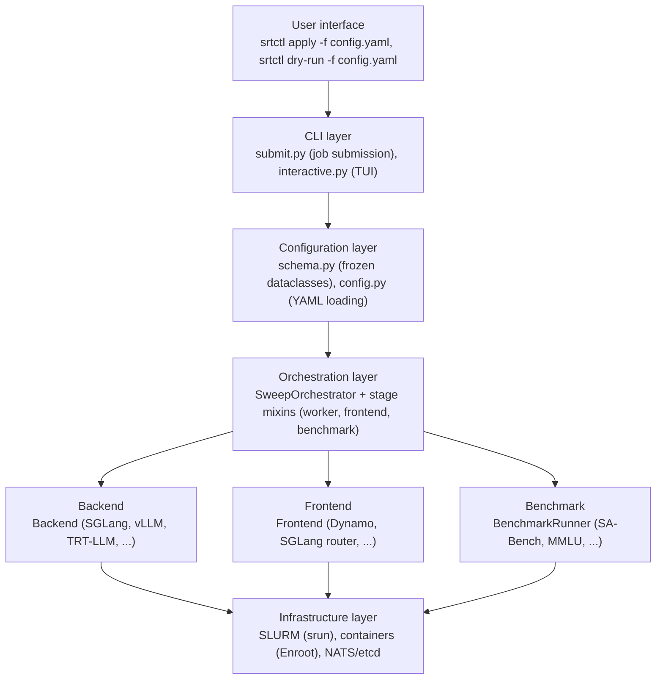

---

## Design Philosophy

### 1. Single Source of Truth

The `RuntimeContext` computes all paths and values **once** at startup. This eliminates:

- Scattered bash variable expansion
- Inconsistent path computation
- Configuration drift during execution

```python
# All runtime values computed in one place
runtime = RuntimeContext.from_config(config, job_id)
runtime.log_dir  # /path/to/logs/12345/logs
runtime.head_node_ip  # 10.0.0.1
runtime.container_mounts  # Dict[Path, Path]
```

### 2. Frozen Dataclasses

All configuration objects are **immutable** after creation using `@dataclass(frozen=True)`:

```python
@dataclass(frozen=True)
class SrtConfig:
    name: str
    model: ModelConfig
    resources: ResourceConfig
    engine: BackendConfig | None
    roles: dict[str, RoleConfig]
    # ... all fields immutable
```

Benefits:

- Prevents accidental mutation
- Easier to reason about state
- Safe to pass around without defensive copying
- Thread-safe by default

### 3. Abstract Base Classes and Inheritance

`Backend` and `Frontend` inherit `abc.ABC`. Concrete implementations inherit their
base and supply all required abstract hooks before they can be instantiated. Optional
behavior lives in the base class, so engines and routers override only what differs.
Type checking also verifies method signatures at typed call sites.

Backend implementations remain frozen dataclasses. They own the configuration fields
and Marshmallow schema; the base provides behavior without adding schema fields.
`RoleConfig` inherits the `RoleSettings` data contract used by backend role helpers.

```python
from abc import ABC, abstractmethod

class Backend(ABC):
    @abstractmethod
    def build_worker_command(...) -> list[str]:
        raise NotImplementedError

    # Other required launch hooks and shared optional defaults live here.

@dataclass(frozen=True)
class SGLangBackend(Backend):
    def build_worker_command(...) -> list[str]:
        # SGLang command construction
        ...
```

Recipe engine names, fields, and frontend selection are unchanged.

### 4. Registry Pattern

Extensible component registration via decorators:

```python
@register_benchmark("sa-bench")
class SABenchRunner(BenchmarkRunner): ...


# Later: get_runner("sa-bench") returns instance
runner = get_runner("sa-bench")
```

### 5. Factory Classmethods

Use `@classmethod` named `from_*` for construction:

```python
RuntimeContext.from_config(config, job_id)
Nodes.from_slurm(benchmark_on_separate_node)
SrtConfig.from_yaml(yaml_path)
```

---

## System Components

### CLI Layer

```
src/srtctl/cli/
|-- __init__.py
|-- submit.py        # Main entry point: srtctl apply/dry-run
|-- do_sweep.py      # SweepOrchestrator - runs inside SLURM job
|-- setup_head.py    # Head node infrastructure (NATS, etcd)
|-- interactive.py   # TUI for job management
|-- mixins/
    |-- worker_stage.py    # Backend worker startup
    |-- frontend_stage.py  # Frontend/nginx startup
    |-- benchmark_stage.py # Benchmark execution
```

#### submit.py - Job Submission

Entry point for `srtctl apply|dry-run -f config.yaml`:

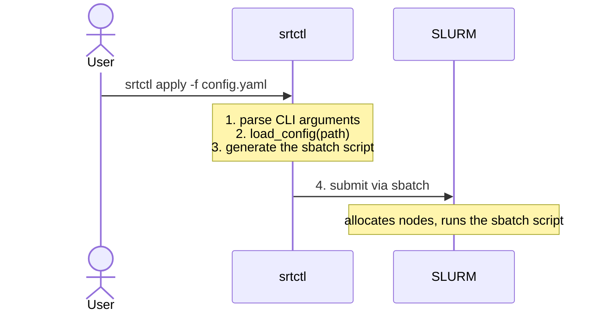

#### do_sweep.py - SweepOrchestrator

The main orchestration class that runs inside the SLURM job:

```python
@dataclass
class SweepOrchestrator(WorkerStageMixin, FrontendStageMixin, BenchmarkStageMixin):
    config: SrtConfig
    runtime: RuntimeContext

    def run(self) -> int:
        """Run the complete benchmark sweep."""
        # Stage 1: Start head infrastructure (NATS, etcd)
        #   (skipped for frontend.type: vllm or trtllm_serve)
        # Stage 2: Start backend workers
        # Stage 3: Start frontends (no-op for frontend.type: vllm — worker owns the port)
        # Stage 4: Run benchmark
        # Cleanup
```

### Configuration Layer

```
src/srtctl/core/
|-- schema.py       # Frozen dataclass definitions
|-- config.py       # YAML loading with cluster defaults
|-- formatting.py   # FormattablePath/String wrappers
|-- runtime.py      # RuntimeContext - single source of truth
```

#### schema.py - Configuration Dataclasses

All configs are **frozen dataclasses** with marshmallow validation. The recipe a user writes is the `schema: 2` layout (`engine:`, `roles:`, `placement:`, `services:`, `dynamo.source:`) and loads straight into these dataclasses; `SrtConfig.topology` and `SrtConfig.backend` are derived from `roles` and `engine` once (see [Config Loading Flow](#config-loading-flow)).

| Class             | Purpose             | Key Fields                                            |
| ----------------- | ------------------- | ----------------------------------------------------- |
| `SrtConfig`       | Main job config     | name, model, resources, engine, roles, frontend, benchmark, services |
| `ModelConfig`     | Model settings      | path, container, precision                            |
| `ResourceConfig`  | Cluster facts       | gpu_type, gpus_per_node, spread_workers, het_jobs     |
| `RoleConfig`      | One worker role     | nodes (or `colocate`), workers, gpus, env, args, extra_args, engine, container, kv_events, critical |
| `Topology`        | Derived worker layout | num_prefill, gpus_per_decode, total_nodes, het_components (from `roles` and `gpus_per_node`) |
| `BackendConfig`   | Polymorphic engine  | type, engine-wide knobs, and `roles` (the recipe's roles, bound at load; per-role args/env are read from them) |
| `FrontendConfig`  | Router settings     | type, enable_multiple_frontends, nginx_raise_ulimit, args, env |
| `BenchmarkConfig` | Benchmark params    | type, isl, osl, concurrencies, sweep                  |
| `ProfilingConfig` | Profiling settings  | type (nsys/torch), phase configs                      |

#### runtime.py - RuntimeContext

The **single source of truth** for all runtime values:

```python
@dataclass(frozen=True)
class RuntimeContext:
    job_id: str
    run_name: str
    nodes: Nodes
    head_node_ip: str
    log_dir: Path
    model_path: Path
    container_image: Path
    gpus_per_node: int
    network_interface: str | None
    container_mounts: dict[Path, Path]
    srun_options: dict[str, str]
    environment: dict[str, str]
    frontend_port: int = 8000

    @classmethod
    def from_config(cls, config: SrtConfig, job_id: str) -> RuntimeContext:
        """All path computation happens here, once at startup."""
```

### Backend Layer

```
src/srtctl/backends/
|-- __init__.py     # Exports BackendConfig, backend classes
|-- base.py         # Backend definition
|-- sglang.py       # SGLangBackend implementation
|-- trtllm.py       # TRTLLMBackend implementation
```

#### Backend

The required hooks identify the engine and define its launch behavior (signatures
abbreviated here):

```python
class Backend(ABC):
    @property
    @abstractmethod
    def type(self) -> str:
        raise NotImplementedError

    @abstractmethod
    def allocate_endpoints(...) -> list[Endpoint]:
        raise NotImplementedError

    @abstractmethod
    def endpoints_to_processes(...) -> list[Process]:
        raise NotImplementedError

    @abstractmethod
    def build_worker_command(...) -> list[str]:
        raise NotImplementedError
```

The base supplies per-process `SrunConfig()` settings, role-based
`get_config_for_mode` and `get_environment_for_mode`, and neutral defaults for
optional features: `mooncake_kv_store` and `failover` return `None`, their environment
hooks and `get_process_environment` return `{}`, and `fatal_log_patterns` returns
`()`. `should_set_visible_devices` defaults to `True`, and `get_served_model_name`
returns the supplied default. Engines override these only when their behavior differs.

Consumers (stage mixins, schema validators, services, dry-run) call these members
directly. There is no `getattr(backend, "x", default)` or `hasattr(backend, "f")` in
`src/`: a backend without a feature inherits the neutral answer. Logic that belongs
to one engine narrows with `isinstance(backend, VLLMBackend)` before reading typed fields.

#### Authoring surface: `engine:` and `roles:`

The user-facing API for a backend is the 2.0 recipe, not the Python backend dataclass. `engine:` names the engine (a string, or a mapping with engine-wide knobs such as vLLM `connector` and `dp_launch_mode`, or TRT-LLM `served_model_name`), and `roles:` holds everything that is per worker role:

```yaml
engine: sglang
roles:
  prefill:
    nodes: 1
    workers: 1
    gpus: 4            # GPUs per worker
    env:               # environment for this role's workers
      PYTHONUNBUFFERED: "1"
    args:              # engine CLI flags for this role
      tensor-parallel-size: 4
    kv_events: true    # optional; the engine's KV events publisher
    # extra_args: []   # TRT-LLM only: raw CLI args appended to the launch
  decode:
    nodes: colocate    # share the prefill nodes' spare GPUs; gpus: is then required on both roles
    workers: 1
    gpus: 4
    args:
      tensor-parallel-size: 4
```

`roles:` loads into `SrtConfig.roles`, one `RoleConfig` per role. `SrtConfig.topology` derives the per-role node, worker, and GPU counts the launch path reads, and `SrtConfig.backend` binds the roles onto the engine, which reads each role's `args`, `env`, `extra_args`, and `kv_events` from them. `nodes: colocate` reserves no decode nodes, and the loader rejects a colocated split that does not fit on the prefill nodes. The pre-2.0 spelling of these settings is documented in [legacy-v1.md](legacy-v1.md); `srtctl migrate` rewrites a v1 recipe into `roles:`.

#### SGLangBackend

Inherits `Backend` for SGLang with P/D disaggregation. Its `roles` carry each role's `env`, `args`, and `kv_events` (`roles.prefill`, `roles.decode`, `roles.agg`, bound at load); `get_config_for_mode(mode)` and `get_environment_for_mode(mode)` hand them to the launch path.

**Launch strategy**: Per-process srun launching (one srun per worker process).

#### TRTLLMBackend

Inherits `Backend` for TRTLLM with MPI-style launching. Its fields are the per-mode `env`, `args`, and `extra_args` from `roles.prefill` and `roles.decode`, plus the engine-wide `served_model_name` from `engine:`.

**Launch strategy**: MPI-style launching (one srun per endpoint with all nodes together). Uses `trtllm-llmapi-launch` for distributed launching.

**Key differences from SGLang**:
- No aggregated mode support
- Uses UUID-based EPLB shared memory naming (`TRTLLM_EPLB_SHM_NAME`)
- MPI launch with `--mpi=pmix` and `--cpu-bind=verbose,none`
- Configuration written to YAML file and passed via `--extra-engine-args`

### Frontend Layer

```
src/srtctl/frontends/
|-- __init__.py     # Exports Frontend
|-- base.py         # Frontend definition
|-- dynamo.py       # DynamoFrontend (NATS/etcd)
|-- sglang.py       # SGLangFrontend (direct router)
|-- trtllm_serve.py # TRTLLMServeFrontend (disagg TRT-LLM orchestrator)
|-- vllm.py         # VLLMFrontend (direct aggregate vllm serve)
```

#### Frontend

Implementations register with `@register_frontend("<type>")` and are imported from the
package `__init__`; `frontend.type` resolves through that registry. Registration accepts
only concrete `Frontend` subclasses and rejects abstract or unrelated classes.
`StaticRouterFrontend` (worker URLs on the CLI) and `DynamicFrontend` (workers register
themselves) inherit `Frontend` and supply shared router behavior.

`Frontend` requires `type` and the hooks that choose worker ports, probe readiness,
and start frontend processes. Its optional defaults include no additional services,
no separate frontend metrics listener, no direct backend health URLs, logical worker
counts for readiness, and no extra recipe validation. Subclasses inherit these
answers or override them. The required hooks are:

```python
class Frontend(ABC):
    @property
    @abstractmethod
    def type(self) -> str: ...

    @abstractmethod
    def worker_api_port(self, mode) -> Literal["public", "allocated"]: ...
    def worker_metrics_path(self, backend, mode) -> str | None: ...  # direct: backend.prometheus_metrics_path (None for gRPC); Dynamo: /metrics
    @abstractmethod
    def worker_metrics_port(self, process, runtime) -> int | None: ...
    @abstractmethod
    def worker_endpoint_port(self, process, config, runtime) -> int | None: ...
    @abstractmethod
    def profiling_control_port(self, process, config, runtime) -> int | None: ...
    @abstractmethod
    def worker_ready_port(self, process) -> int: ...
    @abstractmethod
    def probe_ready(self, host, port, expected_prefill, expected_decode, config) -> WorkerHealthResult: ...
    @abstractmethod
    def start_frontends(
        self, topology, runtime, config, backend, backend_processes, stop_event
    ) -> list[ManagedProcess]: ...
```

### Infrastructure Layer

```
src/srtctl/core/
|-- slurm.py        # SLURM utilities (srun, nodelist parsing)
|-- processes.py    # Process lifecycle management
|-- health.py       # HTTP health checks
|-- topology.py     # Endpoint/Process allocation
```

---

## Architecture Layers

### Layer Diagram

```mermaid
flowchart TD
    subgraph CLI["CLI layer"]
        submit["submit.py<br/>parse args, load config, submit sbatch"]
        do_sweep["do_sweep.py<br/>orchestrate, run the stage mixins"]
        interactive["interactive.py<br/>TUI mode, job browser"]
        setup_head["setup_head.py<br/>start NATS, start etcd"]
    end
    subgraph CONFIG["Configuration layer"]
        schema["schema.py<br/>SrtConfig, ModelConfig (frozen)<br/>RoleConfig / Topology<br/>BackendConfig (polymorphic)"]
        config["config.py<br/>load_config(), YAML parsing<br/>cluster defaults, validation"]
        runtime["runtime.py<br/>RuntimeContext.from_config()<br/>path computation"]
    end
    subgraph ORCH["Orchestration layer"]
        sweep["SweepOrchestrator<br/>WorkerStageMixin: start_worker, start_all_workers<br/>FrontendStageMixin: start_nginx, start_frontend<br/>BenchmarkStageMixin: run_benchmark"]
        registry["ProcessRegistry<br/>add_process(), check_failures(), cleanup()"]
        managed["ManagedProcess<br/>name, popen, log_file, node, terminate()"]
        signals["Signal handlers<br/>SIGTERM/SIGINT, graceful cleanup"]
    end
    subgraph BACKEND["Backend layer"]
        backend["Backend (ABC)<br/>get_srun_config(), allocate_endpoints()<br/>endpoints_to_processes(), build_worker_command()"]
        backend_impls["Implementations<br/>SGLangBackend (per-process srun)<br/>TRTLLMBackend (MPI-style srun)"]
    end
    subgraph FRONTEND["Frontend layer"]
        frontend["Frontend (ABC)<br/>start_frontends(), probe_ready(), worker_launch"]
        frontend_impls["DynamoFrontend: srun process, /health JSON, dynamo launch<br/>SGLangRouter: srun process, /workers JSON, direct launch<br/>TRTLLMServe: srun process, bare 200, direct launch<br/>VLLMFrontend: no process, /health + /v1/models, direct launch"]
    end
    subgraph INFRA["Infrastructure layer"]
        slurm["slurm.py<br/>SlurmLauncher, get_slurm_nodelist(), get_hostname_ip()"]
        processes["processes.py<br/>ManagedProcess, ProcessRegistry, signal handlers"]
        health["health.py<br/>wait_for_port(), wait_for_model(), health parsers"]
    end
    CLI -- "SrtConfig, RuntimeContext" --> CONFIG
    CONFIG -- "Endpoints, Processes" --> ORCH
    ORCH -- "Commands, health checks" --> BACKEND
    BACKEND --> FRONTEND
    FRONTEND --> INFRA
```

---

## Data Flow Diagrams

### Config Loading Flow

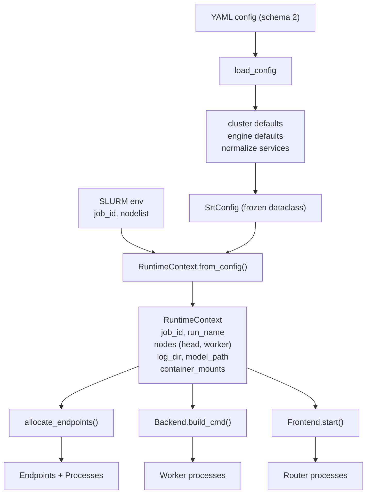

### Job Submission Flow

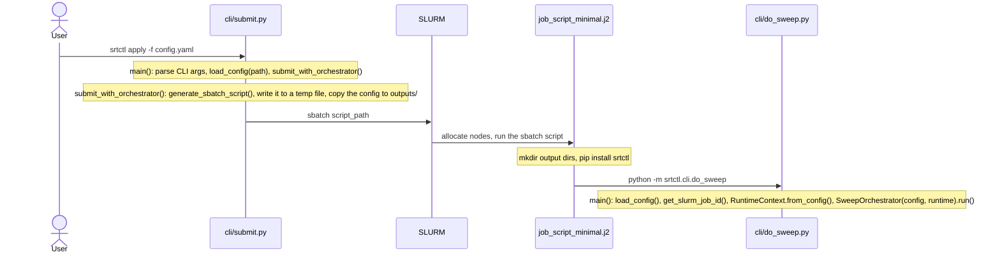

### Worker Startup Flow

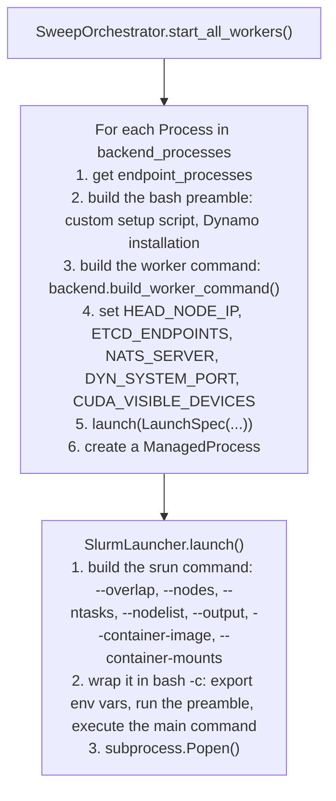

### Health Check Flow

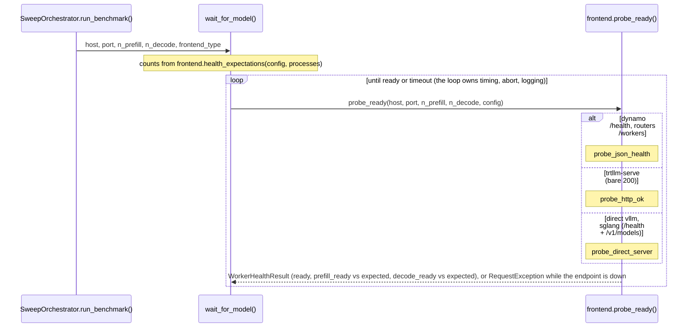

---

## Process Architecture on SLURM Cluster

### Physical Layout

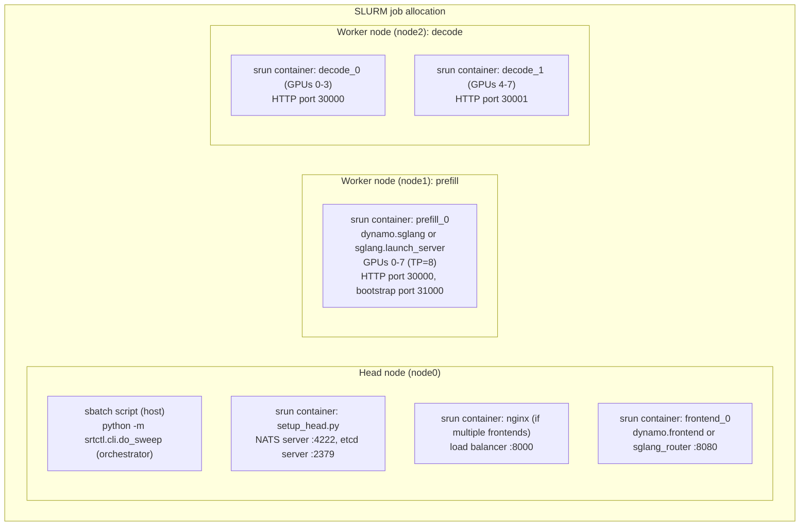

### Port Allocation Strategy

Fixed ports are constants in `srtctl/ports.py`. Every port a worker process binds is
a `PortKind` in the same module and is handed out by `NodePortAllocator.next(kind,
node, size)` once, in `endpoints_to_processes`; the value rides on `Process` and no
consumer derives one port from another.

| PortKind | Base | Stride | Counter | Bound by |
| --- | --- | --- | --- | --- |
| `sys` | 7500 | 1 | global | every process (`DYN_SYSTEM_PORT`) |
| `http` | 6100 | 32 | per node | endpoint leaders (a router connects) |
| `bootstrap` | 7200 | 1 | per node | prefill endpoints |
| `kv_events` | 5200 | 1 | global | every process (block per local DP size) |
| `nixl` | 5400 | 1 | global | every process (block per DP size) |
| `dp_rpc` | 8400 | 1 | per node | vLLM DP endpoints |
| `kvbm_zmq` | 5600 | 2 | global | KVBM leaders (pub, ack = pub + 1) |
| `sidecar_grpc` | 50051 | 1 | global | Dynamo sidecars (base: `sidecar_port`) |
| `nccl` | 17500 | 1 | global | SGLang servers |
| `dist_init` | 8300 | 1 | per node | SGLang multi-node endpoints (leader) |
| `vllm_scan` | 20000 | 50 | global | vLLM `get_open_port()` scan range |
| `moriio_handshake` | 40000 | 1 | global | vLLM MoRI-IO workers (peer handshake) |
| `moriio_notify` | 41000 | 1 | global | vLLM MoRI-IO workers (block per rank) |
| `trtllm_dist_init` | 29500 | 1 | global | TRT-LLM endpoints (leader's `MASTER_PORT`) |

Fixed constants: frontend public port 8000, internal 8180 (behind nginx); etcd 2379, NATS 4222.

### Process Relationships

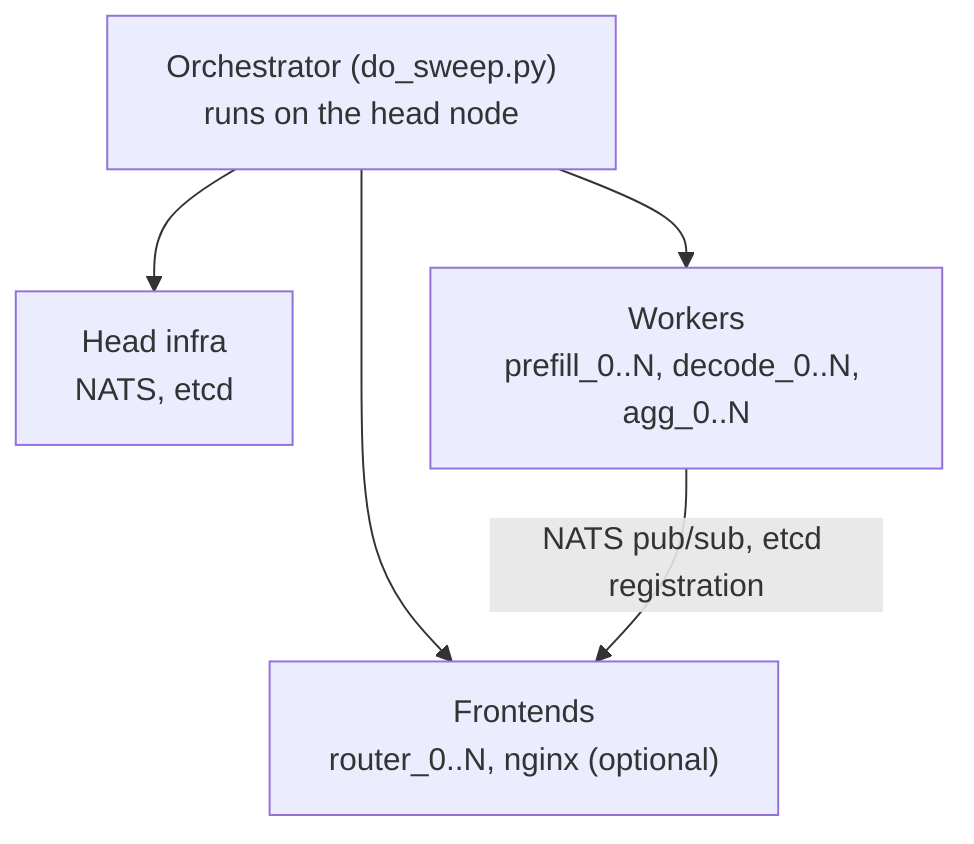

---

## Key Abstractions

### RuntimeContext

The **single source of truth** for all runtime values. Created once at job start:

```python
@dataclass(frozen=True)
class RuntimeContext:
    # Runtime identifiers
    job_id: str
    run_name: str

    # Node topology
    nodes: Nodes  # head, bench, worker tuple
    head_node_ip: str

    # Computed paths (all absolute)
    log_dir: Path
    model_path: Path
    container_image: Path

    # Resource configuration
    gpus_per_node: int
    network_interface: str | None

    # Container mounts: host_path -> container_path
    container_mounts: dict[Path, Path]

    @classmethod
    def from_config(cls, config: SrtConfig, job_id: str) -> RuntimeContext:
        """All path computation happens here, once at startup."""
```

### Endpoint vs Process

An endpoint is the logical unit: it may span nodes and has a mode and index. A process is the physical unit: it runs on one node and owns the ports. Example, a TP=16 endpoint on 8-GPU nodes:

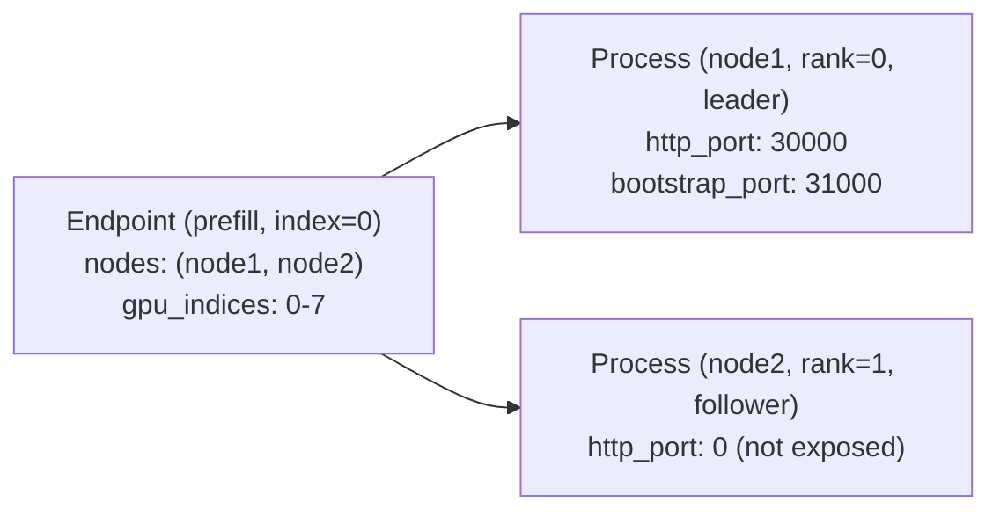

### NodePortAllocator

Manages per-node port assignments to avoid conflicts:

```python
@dataclass
class NodePortAllocator:
    base_http_port: int = 30000
    base_bootstrap_port: int = 31000
    base_kv_events_port: int = 5550

    def next_http_port(self, node: str) -> int:
        """Get next available HTTP port for a node."""

    def next_bootstrap_port(self, node: str) -> int:
        """Get next available bootstrap port for a node."""

    def next_kv_events_port(self) -> int:
        """Get next available kv-events port (globally unique)."""
```

### ProcessRegistry

Lifecycle management for all spawned processes:

```python
class ProcessRegistry:
    def add_process(self, process: ManagedProcess) -> None:
        """Add a process to the registry."""

    def check_failures(self) -> bool:
        """A critical process exited non-zero, or its log matched one of its fatal_log_patterns while the step still runs."""

    def cleanup(self) -> None:
        """Terminate all registered processes."""

    def print_failure_details(self, tail_lines: int = 50) -> None:
        """Print detailed failure info with log tails."""
```

### ManagedProcess

```python
@dataclass
class ManagedProcess:
    name: str  # e.g., "prefill_0", "decode_1"
    popen: subprocess.Popen
    log_file: Path | None
    node: str | None
    critical: bool = True  # Failure triggers cleanup
    fatal_log_patterns: tuple[str, ...] = ()  # Log lines that mean the engine died behind a live srun step

    @property
    def is_running(self) -> bool: ...

    def terminate(self, timeout: float = 10.0) -> None:
        """Terminate gracefully, then kill if needed."""
```

---

## Extension Points

### How to Add a New Backend

1. **Create backend module** at `backends/mybackend.py`:

```python
from collections.abc import Mapping
from dataclasses import field
from typing import Literal

from marshmallow_dataclass import dataclass as marshmallow_dataclass
from srtctl.backends.base import Backend, BoundRolesField, RoleSettings

@marshmallow_dataclass(frozen=True)
class MyBackend(Backend):
    type: Literal["mybackend"] = "mybackend"

    # Configuration fields stay on the concrete frozen dataclass.
    my_option: str | None = None
    roles: Mapping[str, RoleSettings] = field(
        default_factory=dict, metadata={"marshmallow_field": BoundRolesField()}
    )

    # Inherit role arguments, role environment, and optional feature defaults.

    def allocate_endpoints(self, ...) -> list[Endpoint]:
        """Allocate logical endpoints to nodes."""
        from srtctl.core.topology import allocate_endpoints
        return allocate_endpoints(...)

    def endpoints_to_processes(self, endpoints, base_sys_port=8081) -> list[Process]:
        """Convert endpoints to physical processes."""
        from srtctl.core.topology import endpoints_to_processes
        return endpoints_to_processes(endpoints, base_sys_port)

    def build_worker_command(self, process, endpoint_processes, runtime, ...) -> list[str]:
        """Build command to start worker process."""
        cmd = ["python3", "-m", "mybackend.server", ...]
        return cmd
```

2. **Register in `backends/__init__.py`**:

```python
from .mybackend import MyBackend

BackendConfig = SGLangBackend | MyBackend
```

3. **Update BackendConfigField in schema.py** to handle polymorphic deserialization.

### How to Add a New Frontend

Decide first whether it is a new process or a mode of an existing router (a discovery
flag, another connector); a mode is an override in the existing class.

1. **Create frontend module** at `frontends/myrouter.py`, subclassing the base that matches
   how it learns about workers, and register it:

```python
from srtctl.frontends.base import register_frontend
from srtctl.frontends.static_router import StaticRouterFrontend  # or DynamicFrontend


@register_frontend("myrouter")
class MyRouterFrontend(StaticRouterFrontend):
    type = "myrouter"
    required_backend = "vllm"
    executable = ("myrouter",)
    pd_flag = "--pd"
    process_name = "myrouter"

    def validate(self, config) -> None:
        """Recipe rules; raise ValueError with the user-facing message."""

    # Override only the hooks whose answer differs from the base:
    # worker_bootstrap_port, build_router_command, probe_ready, health_expectations,
    # worker_metrics_port, worker_endpoint_port, frontend_metrics_port, implied_services.
```

2. **Import it from `frontends/__init__.py`**. That is the registration; the schema,
   backends, telemetry, benchmark stage, and readiness loop need no edits.

3. Add `tests/test_myrouter_frontend.py` (use `start_process` as the launch seam), a
   `docs/myrouter.md` page, and an `examples/` recipe.

### How to Add a New Benchmark

1. **Create benchmark module** at `benchmarks/mybench.py`:

```python
from srtctl.benchmarks.base import BenchmarkRunner, register_benchmark


@register_benchmark("mybench")
class MyBenchRunner(BenchmarkRunner):
    @property
    def name(self) -> str:
        return "My Benchmark"

    @property
    def script_path(self) -> str:
        return "/srtctl-benchmarks/mybench/run.sh"

    def validate_config(self, config: SrtConfig) -> list[str]:
        """Return list of validation errors (empty if valid)."""
        errors = []
        if config.benchmark.my_required_field is None:
            errors.append("benchmark.my_required_field is required")
        return errors

    def build_command(self, config: SrtConfig, runtime: RuntimeContext) -> list[str]:
        """Build benchmark command."""
        return [
            "python3",
            self.script_path,
            "--host",
            runtime.nodes.head,
            "--port",
            str(runtime.frontend_port),
            # ... other args
        ]
```

2. **Add benchmark script** at `benchmarks/scripts/mybench/run.sh`

3. **Import in `benchmarks/__init__.py`** to trigger registration:

```python
from . import mybench  # noqa: F401
```

---

## Module Dependencies

### Import Hierarchy

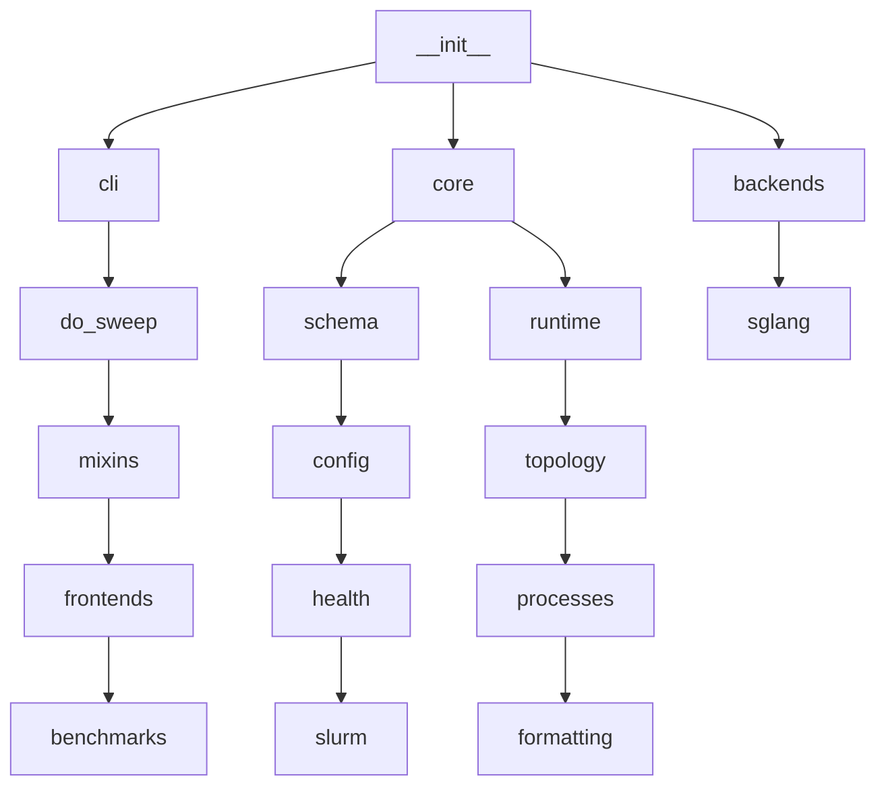

### Circular Import Prevention

1. **TYPE_CHECKING guard** - Import type-only dependencies:

```python
from typing import TYPE_CHECKING

if TYPE_CHECKING:
    from srtctl.core.runtime import RuntimeContext
    from srtctl.core.schema import SrtConfig
```

2. **Lazy imports** - Import at function call time:

```python
def _validate_frontend(self) -> None:
    # Import here to avoid circular imports: frontends import core.schema.
    from srtctl.frontends import get_frontend, list_frontend_types

    ...
```

3. **Forward references** - Use string annotations:

```python
def from_config(cls, config: "SrtConfig", job_id: str) -> "RuntimeContext": ...
```

---

## Directory Structure

```
src/srtctl/
|-- __init__.py              # Package exports and version
|-- logging_utils.py         # Logging configuration
|
|-- core/                    # Core infrastructure
|   |-- __init__.py          # Core exports
|   |-- config.py            # Config loading with cluster defaults
|   |-- schema.py            # Frozen dataclass definitions
|   |-- runtime.py           # RuntimeContext - single source of truth
|   |-- topology.py          # Endpoint/Process allocation
|   |-- processes.py         # Process lifecycle management
|   |-- slurm.py             # SLURM utilities (srun, nodelist)
|   |-- health.py            # HTTP health checks
|   |-- formatting.py        # FormattablePath/String wrappers
|   |-- sweep.py             # Parameter sweep generation
|   |-- ip_utils/            # IP resolution utilities
|       |-- __init__.py
|       |-- get_node_ip.sh
|
|-- backends/                # Backend implementations
|   |-- __init__.py          # Exports BackendConfig, backend classes
|   |-- base.py              # Backend definition
|   |-- sglang.py            # SGLangBackend implementation
|   |-- trtllm.py            # TRTLLMBackend implementation
|
|-- frontends/               # Frontend implementations
|   |-- __init__.py          # Exports Frontend
|   |-- base.py              # Frontend definition
|   |-- dynamo.py            # DynamoFrontend (NATS/etcd)
|   |-- sglang.py            # SGLangFrontend (direct router)
|   |-- trtllm_serve.py      # TRTLLMServeFrontend (disagg orchestrator)
|   |-- vllm.py              # VLLMFrontend (direct aggregate vllm serve)
|
|-- cli/                     # CLI entry points
|   |-- __init__.py
|   |-- submit.py            # srtctl apply/dry-run commands
|   |-- do_sweep.py          # SweepOrchestrator
|   |-- setup_head.py        # Head node infrastructure
|   |-- interactive.py       # Interactive mode
|   |-- mixins/              # Orchestrator stage mixins
|       |-- __init__.py
|       |-- worker_stage.py      # Backend worker startup
|       |-- frontend_stage.py    # Frontend/nginx startup
|       |-- benchmark_stage.py   # Benchmark execution
|
|-- benchmarks/              # Benchmark runners
|   |-- __init__.py          # Registry and exports
|   |-- base.py              # BenchmarkRunner ABC, register_benchmark
|   |-- sa_bench.py          # SA-Bench throughput benchmark
|   |-- aime.py              # AIME math accuracy benchmark
|   |-- mmlu.py              # MMLU accuracy benchmark
|   |-- gpqa.py              # GPQA benchmark
|   |-- longbenchv2.py       # LongBench v2 benchmark
|   |-- router.py            # Router benchmark
|   |-- mooncake_router.py   # Mooncake router benchmark
|   |-- profiling.py         # Profiling benchmark
|   |-- scripts/             # Benchmark shell scripts
|       |-- sa-bench/
|           |-- bench.sh
|           |-- benchmark_serving.py
|           |-- ...
|
|-- templates/               # Jinja2 templates
    |-- job_script_minimal.j2    # sbatch script template
    |-- nginx.conf.j2            # nginx load balancer config
```

---

## Summary

srtctl is a well-architected orchestration framework with:

- **Clean separation of concerns**: Config, runtime, backend, frontend, benchmark layers
- **Strong typing**: Frozen dataclasses with marshmallow validation
- **Extensibility**: Abstract base classes for backends/frontends, decorator-based benchmark registration
- **Robust process management**: Registry, monitoring, graceful cleanup
- **SLURM integration**: Proper container mounts, srun launching, nodelist parsing
- **Modern Python**: 3.10+ syntax, comprehensive type hints, clear module structure

The codebase follows Python best practices and provides a solid foundation for orchestrating complex LLM inference workloads on SLURM clusters.
