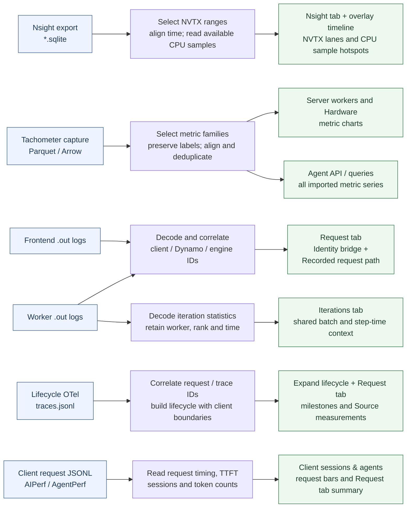
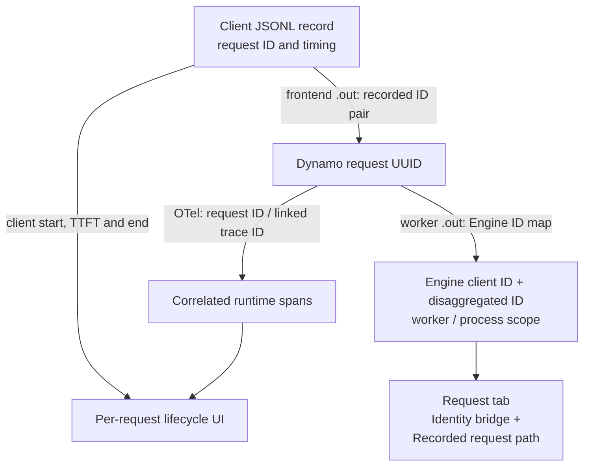

# DSight data flow: from captured files to UI

Use this page to answer: **Which file supplies this part of the dashboard, and
what happens to its data along the way?** See [DSight](dsight.md) for build
commands, input discovery and detailed timing definitions.

## Source files to visible views

The arrows below describe the current implementation. Blue boxes are saved
inputs; green boxes name their destinations in the UI. Each path shows what a
source contributes. The request-identity dependencies are expanded in the next
diagram.

The Python readers produce one normalized dataset containing requests, sessions,
workers, metrics, profiles and iterations, with references back to source files
and rows. The builder writes `trace-data.json.gz` and embeds the same data in
`index.html`. The browser reads those normalized records; it does not open the
original SQLite, Parquet or log files.

All views share time relative to the first selected client request. Nsight uses
its recorded UTC anchor; metric samples use their recorded epoch timestamps.
Iteration logs need `--iteration-timezone` to align their whole-second timestamps;
without it they remain unaligned. No cross-host clock correction is inferred.

The UI destinations use the current section and tab names:

| Visible area | What its data means |
| --- | --- |
| **Nsight** tab and overlay | NVTX intervals arranged by thread and overlap lane, alongside the selected request. Available frontend CPU samples feed **Frontend CPU sample hotspots**. CUDA kernel timing is not imported. |
| **Server workers** | Currently selected TRT-LLM running/waiting/KV gauges or Dynamo worker in-flight requests, preserving each selected rank/label series. |
| **Hardware** | GPU utilization and available host RAM charts. |
| **Agent API / queries** | All imported metric series, including SGLang and frontend/service gauges that the current chart selectors do not expose. |
| **Iterations** tab | Shared batch statistics, host-loop time and previous-device time; these are not per-request stage durations. |
| **Request** tab | Client measurements, recorded ID mappings, worker path and correlated OTel source measurements. **Expand lifecycle** adds cumulative milestone rows under the request. |

The Nsight overlay is a time-based NVTX timeline. Its CPU hotspot table is a
separate view of samples, not an aggregate CPU flamegraph.

## Following one request across sources

The client export establishes the request and its timing. Frontend logs bridge
its HTTP request ID to the Dynamo UUID. That UUID connects to OTel spans and,
independently, to engine-local IDs from worker logs.

- **OTel supplies the existing request breakdown.** Supported spans retain their
  timestamps, parents and inclusive durations. Client start/first-token/end
  boundaries and server milestones produce the progress rows. An engine ID map
  is not required to construct these rows.
- **Engine ID maps supply identity and navigation.** TRT-LLM logs associate the
  Dynamo UUID with an engine client ID and disaggregated ID. Worker identity
  comes from the log filename; process association comes from matching recorded
  host/role/process attributes in correlated spans when unambiguous. These IDs
  appear under **Identity bridge** and support the recorded worker path.
- **Timing overlap supplies shared context.** A matching worker and overlapping
  Nsight range or iteration can be inspected beside a request. That overlap does
  not assign the batch's execution cost to the request.

An ID pair alone contains no queue, compute or KV-transfer duration. The current
engine log decoder supplies ID maps and iteration summaries, so it does not add
an engine-specific per-request breakdown beyond OTel.

## What the shared engine interface contributes

The engine interface centralizes vocabulary while the readers keep I/O, clocks,
correlation, source references and limits.

| Input to the engine interface | Answer returned to the reader |
| --- | --- |
| One worker-log line | A typed engine identity and/or iteration record, or no recognized record. |
| An NVTX name and duration | Whether to include that host annotation. Original names and timestamps remain in the profile records. |
| A recorded metric name | Whether the engine catalog includes it, plus its display label and original unit. Values and labels remain in the metric reader. |

TRT-LLM currently supplies all three kinds of rules. SGLang supplies NVTX prefixes
and metric definitions; it has no worker-log decoder here. A dialect can omit
sources it cannot interpret.

## Missing inputs

| Missing input | Current behavior |
| --- | --- |
| Client request export | Build fails: this version requires one selected AIPerf or AgentPerf export to establish requests and the time window. |
| Frontend ID bridge | Requests retain client timing; correlation to Dynamo/engine IDs is unavailable. |
| Supported, correlated OTel | The affected request has no lifecycle expansion, milestone rows or source-measurement breakdown. Its client bar and TTFT remain. |
| Worker logs / engine ID maps | Engine identity and iteration context are absent where unrecorded. Metrics and Nsight remain independently importable. |
| Nsight export | No profile data is embedded; the Nsight inspector reports that exports are absent. |
| Tachometer capture | No metric series is imported; metric lanes can remain empty. |

Omitting an optional source is different from selecting a missing or malformed
file, which can produce a warning or error. Some empty optional-source
sections remain visible; the table describes current behavior.
